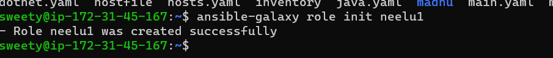
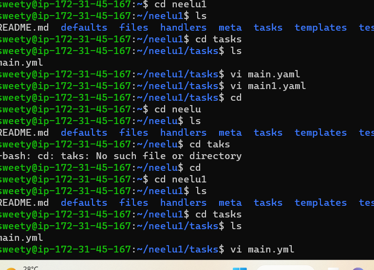
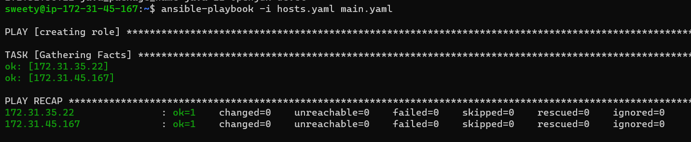
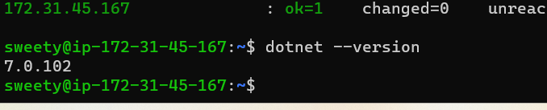
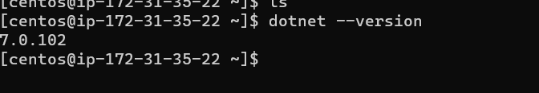

### HOW TO INSTALL DOTNET APPLICATION :

* Manual steps for install dotnet application:
  ------------------------------------------- 
   * UBUNTU:
     ------- 

```
wget https://packages.microsoft.com/config/ubuntu/22.04/packages-microsoft-prod.deb 
sudo dpkg -i packages-microsoft-prod.deb 
sudo apt install apt-transport-https 
sudo apt update 
sudo apt install dotnet-sdk-6.0 -y 
sudo apt install dotnet-runtime-6.0 -y
dotnet --version

```
   * CENTOS:
     -------

```
sudo rpm -Uvh https://packages.microsoft.com/config/centos/7/packages-microsoft-prod.rpm
sudo yum install aspnetcore-runtime-7.0
sudo yum install dotnet-runtime-7.0
dotnet --version

```
* Write single playbook for the this application both ubuntu and centos :
  ---------------------------------------------------------------------
```yaml
---
- name: install dotnet on ubuntu
  hosts: all
  become: yes
  tasks:
    - name: install microsoft package on ubuntu
      ansible.builtin.get_url:
        url: "{{ dotnet_url_ubuntu }}"
        dest: /tmp
        mode: 777
      when: ansible_facts['distribution'] == "Ubuntu"
    - name: install microsoft package on centos
      ansible.builtin.get_url:
        url: "{{ dotnet_url_centos }}"
        dest: /tmp
        mode: 777
      when: ansible_facts['distribution'] == "CentOS"
    - name: install microsoft debian package
      ansible.builtin.apt:
        deb: /tmp/packages-microsoft-prod.deb
      when: ansible_facts['distribution'] == "Ubuntu"
    - name: install microsoft rpm package
      ansible.builtin.yum:
        name: /tmp/packages-microsoft-prod.rpm
        state: present
      when: ansible_facts['distribution'] == "CentOS"
    - name: Install dotnetcore SDK on ubuntu
      ansible.builtin.package:
        name:
          - "{{ transport_url }}"
          - "{{ sdk_version }}"
        state: present
      when: ansible_facts['distribution'] == "Ubuntu"
    - name: Install dotnetcore SDK on centos
      ansible.builtin.package:
        name:
          - "{{ transport_url }}"
          - "{{ sdk_version }}"
        state: present
      when: ansible_facts['distribution'] == "CentOS"
    - name: Install dotnetcore runtime on ubuntu
      ansible.builtin.package:
        name:
          - "{{ transport_url }}"
          - "{{ runtime_version }}"
        state: present
      when: ansible_facts['distribution'] == "Ubuntu"
    - name: Install dotnetcore runtime on centos
      ansible.builtin.package:
        name:
          - "{{ transport_url }}"
          - "{{ runtime_version }}"
        state: present
      when: ansible_facts['distribution'] == "CentOS"  
```
* Hostfile of the dotnet playbook:
  --------------------------------
```yaml
---
all:
  children:
    webserver:
      hosts:
        172.31.45.167:
          dotnet_url_ubuntu: https://packages.microsoft.com/config/ubuntu/22.10/packages-microsoft-prod.deb 
          transport_url: aspnetcore-runtime-7.0
          sdk_version: dotnet-sdk-7.0 
          runtime_version: dotnet-runtime-7.0
        172.31.35.22:
          dotnet_url_centos: https://packages.microsoft.com/config/centos/7/packages-microsoft-prod.rpm 
          transport_url: aspnetcore-runtime-7.0
          sdk_version: dotnet-sdk-7.0 
          runtime_version: dotnet-runtime-7.0
```
* Create role in ansinle
  

* Applying ansible role


```yaml
- name: install microsoft package on ubuntu
      ansible.builtin.get_url:
        url: "{{ dotnet_url_ubuntu }}"
        dest: /tmp
        mode: 777
      when: ansible_facts['distribution'] == "Ubuntu"
    - name: install microsoft package on centos
      ansible.builtin.get_url:
        url: "{{ dotnet_url_centos }}"
        dest: /tmp
        mode: 777
      when: ansible_facts['distribution'] == "CentOS"
    - name: install microsoft debian package
      ansible.builtin.apt:
        deb: /tmp/packages-microsoft-prod.deb
      when: ansible_facts['distribution'] == "Ubuntu"
    - name: install microsoft rpm package
      ansible.builtin.yum:
        name: /tmp/packages-microsoft-prod.rpm
        state: present
      when: ansible_facts['distribution'] == "CentOS"
    - name: Install dotnetcore SDK on ubuntu
      ansible.builtin.package:
        name:
          - "{{ transport_url }}"
          - "{{ sdk_version }}"
        state: present
      when: ansible_facts['distribution'] == "Ubuntu"
    - name: Install dotnetcore SDK on centos
      ansible.builtin.package:
        name:
          - "{{ transport_url }}"
          - "{{ sdk_version }}"
        state: present
      when: ansible_facts['distribution'] == "CentOS"
    - name: Install dotnetcore runtime on ubuntu
      ansible.builtin.package:
        name:
          - "{{ transport_url }}"
          - "{{ runtime_version }}"
        state: present
      when: ansible_facts['distribution'] == "Ubuntu"
    - name: Install dotnetcore runtime on centos
      ansible.builtin.package:
        name:
          - "{{ transport_url }}"
          - "{{ runtime_version }}"
        state: present
      when: ansible_facts['distribution'] == "CentOS"
```
* Write a ansible playbook for the role
```yaml
---
- name: creating role
  hosts: all
  become: yes
  roles:
    - neelu1
```
* To run this playbook in ansible master node


* Output of the application 

 in ubuntu
 in centos    

           
       
