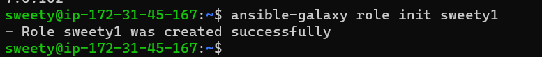
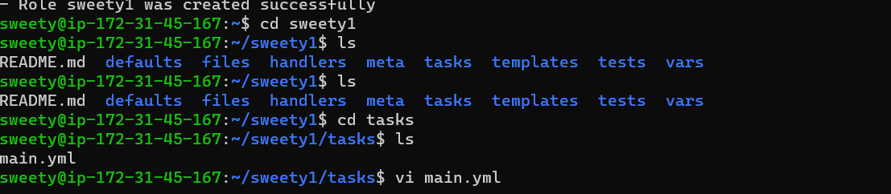
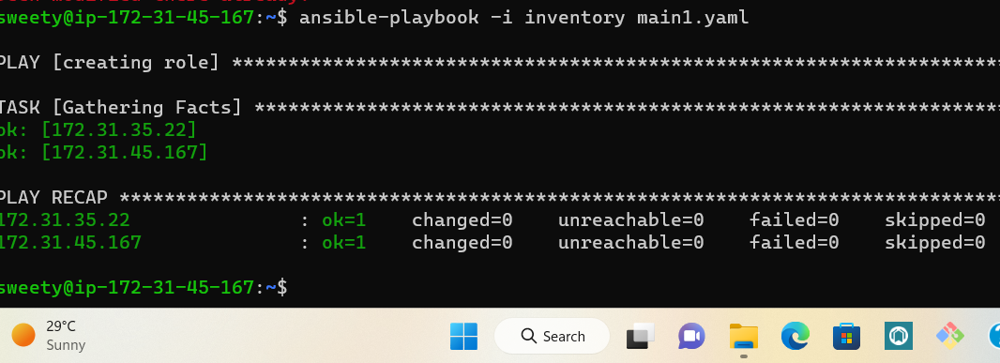
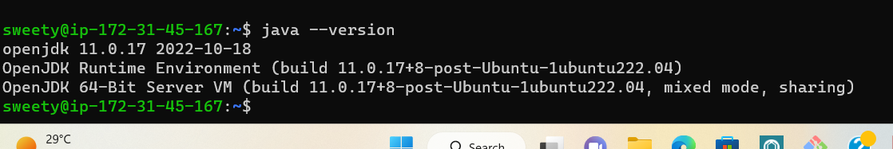
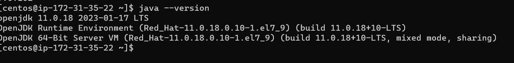

### HOW TO INSTALL JAVA11 :

* Manual steps for Java11 installation:
  ------------------------------------------- 
   * UBUNTU:
     ------- 
```     
sudo apt update
sudo apt install openjdk-11-jdk 
java --version 

```
   * CENTOS:
     -------
```
sudo yum update
sudo yum install java-11-openjdk-devel
java --version

```
* Write single playbook for the this application both ubuntu and centos :
  ---------------------------------------------------------------------

```yaml
---
- name: install java11
  hosts: all
  become: yes
  tasks:
    - name: install java11
      ansible.builtin.package:
        name: "{{ java_package_name }}"
        update_cache: yes
        state: present
```
* Inventory of the Java application:
  -----------------------------------
```yaml
[appservers]
172.31.45.167 java_package_name=openjdk-11-jdk 
172.31.35.22 java_package_name=java-11-openjdk-devel

```
* Create role in ansinle


* Applying ansible role


```yaml
- name: install java11
  ansible.builtin.package:
    name: "{{ java_package_name }}"
    update_cache: yes
    state: present
```
* Write a ansible playbook for the role
```yaml
---
- name: creating role
  hosts: all
  become: yes
  roles:
    - sweety1
```
* To run this playbook in ansible master node


* Output of the application
 in ubuntu
 in centos 
    

   
  
  

 

