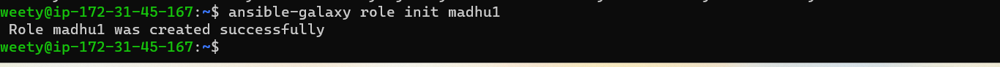
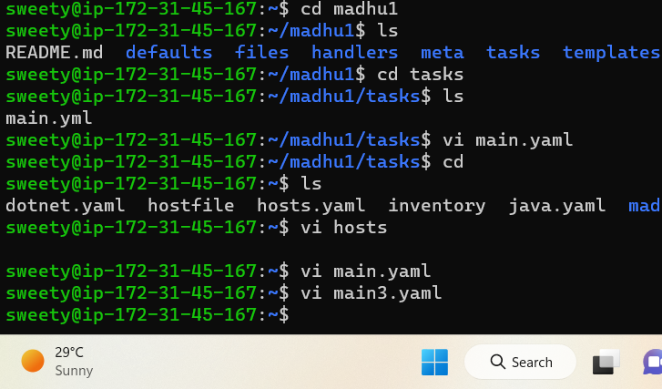
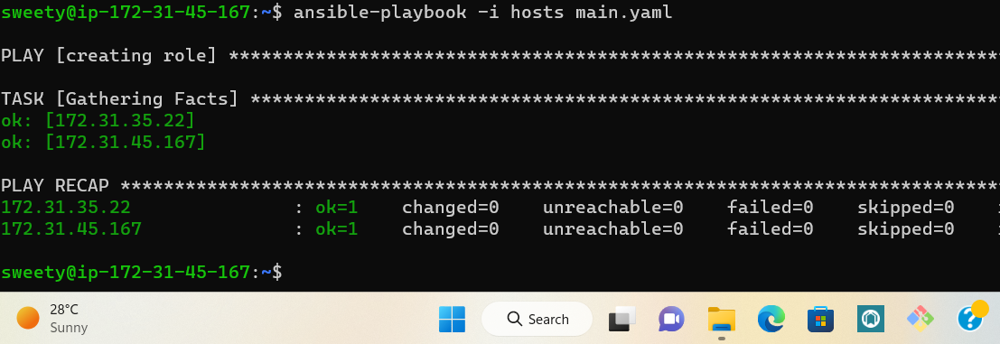
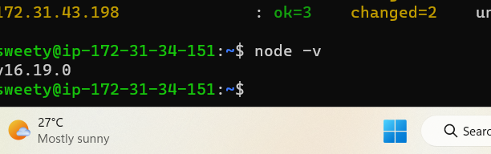
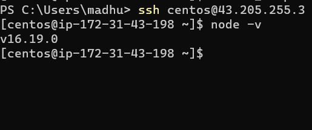

### HOW TO INSTALL NODEJS APPLICATION :

* Manual steps for install Nodejs application:
  ------------------------------------------- 
   * UBUNTU:
     ------- 
```
sudo apt update
curl -sL https://deb.nodesource.com/setup_16.x | sudo -E bash -
sudo apt install nodejs
node -v

```
   * CENTOS:
     -------
```
sudo yum update
curl -sL https://rpm.nodesource.com/setup_16.x | sudo bash -
sudo yum install nodejs
node -v

```
* Write single playbook for the this application both ubuntu and centos :
  ---------------------------------------------------------------------
```yaml
---
- name: install nodejs on ubuntu
  hosts: all
  become: yes
  tasks:
    - name: shellfile
      ansible.builtin.shell: "{{ Nodejs_Package_name }}"
    - name: install nodejs in ubuntu
      ansible.builtin.package:
        name: "{{ Nodejs_Package }}"
        state: present
```
* Hostfile of the dotnet application:
  ------------------------------------
```yaml
[appservers]
172.31.45.167 Nodejs_Package_name=curl -sL https://deb.nodesource.com/setup_16.x | sudo -E bash -
172.31.35.22 Nodejs_Package_name=curl -sL https://rpm.nodesource.com/setup_16.x | sudo bash -

[appservers_vars]
Nodejs_Package=nodejs

```
* Create role in ansinle


* Applying ansible role


* Write a ansible playbook for the role
```yaml
---
- name: creating role
  hosts: all
  become: yes
  roles:
    - madhu1
```
* To run this playbook in ansible master node


* Output of the application
 in ubuntu
 in centos 
    

   
  
  

 


  

 


